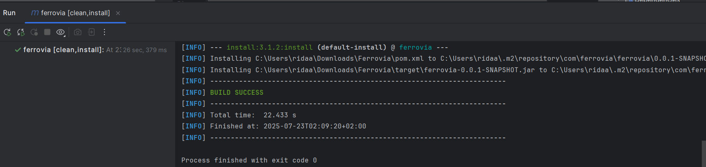
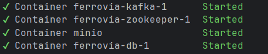

#  Projet Microservices Bibliothèque 
### Auteurs : Rida ADARDOUR et Tarek OMARI

## Présentation

Ce projet met en œuvre une architecture complète pour la gestion d’une bibliothèque :
- Génération automatique d’emprunts toutes les 30 secondes
- Stockage relationnel (PostgreSQL)
- Bus de messages Kafka
- Stockage objet MinIO
- Orchestration avec Docker

---

## Schéma d’architecture

  
*Architecture globale : l’utilisateur communique avec l’API, qui échange avec PostgreSQL, Kafka et MinIO.*

---

## 1. Compilation et déploiement du projet

- **Compilation du projet Maven**  
    
  *Lancement du build Maven (clean install) dans IntelliJ.*

- **Build Success**  
    
  *Résultat de la compilation : BUILD SUCCESS.*

---

## 2. Démarrage de l’infrastructure

- **Démarrage des conteneurs Docker**  
    
  *Tous les conteneurs sont bien démarrés.*

- **Liste des conteneurs Docker**  
    
  *Liste détaillée des conteneurs actifs avec `docker ps`.*

---

## 3. Lancement de l’application Spring Boot

- **Démarrage de l’application**  
    
  *Lancement de l’application via IntelliJ.*

- **Application démarrée avec succès**  
    
  *L’application Spring Boot est prête et fonctionne.*

- **Logs de génération d’emprunts**  
    
  *Chaque emprunt est généré automatiquement, envoyé à Kafka et MinIO.*

---

## 4. Monitoring Kafka dans IntelliJ

- **Inspection du topic Kafka "emprunts"**  
    
  *Topic `emprunts` visible dans l’extension Kafka d’IntelliJ.*

- **Vue du Consumer Group**  
    
  *Le consumer group `biblio-group` consomme les messages du topic `emprunts`.*

---

## 5. Accès aux données dans PostgreSQL

- **Table `emprunt` avec les données générées**  
    
  *Contenu de la table `emprunt` dans DataGrip.*

- **Explorateur de base de données**  
    
  *Les trois tables du modèle : livre, adherent, emprunt.*

- **Schéma relationnel**  
    
  *Relations entre les tables du modèle.*

---

## 6. Monitoring Kafka en CLI

- **Lecture des messages Kafka via le shell**  
    
  *Affichage des messages JSON du topic `emprunts` dans le terminal du conteneur Kafka.*

---

## 7. MinIO : stockage objet

- **Page de login MinIO**  
    
  *Console web MinIO (localhost:9001) : accès à l’administration.*

- **Bucket `biblio` rempli d’emprunts**  
    
  *Tous les emprunts sont stockés en fichiers `.txt` dans le bucket `biblio` sur MinIO.*

---

## 8. Arborescence du projet


---

## Conclusion

> Ce projet montre comment automatiser la gestion d’une bibliothèque grâce à une architecture microservices moderne :
> - génération d’évènements
> - persistance relationnelle
> - communication asynchrone (Kafka)
> - stockage objet distribué
---
##  Exécution rapide

```bash
# 1. Cloner le projet
git clone git repository
cd ferrovia

# 2. Lancer les services Docker (Postgres, Kafka, Zookeeper, MinIO)
docker-compose up -d

# (Optionnel) Vérifier les conteneurs
docker ps

# 3. Compiler le projet Spring Boot
mvn clean install

# 4. Lancer l’application (choisir une des deux commandes)
./mvnw spring-boot:run
# ou
mvn spring-boot:run

# 5. (Après usage) Stopper tous les services
docker-compose down


